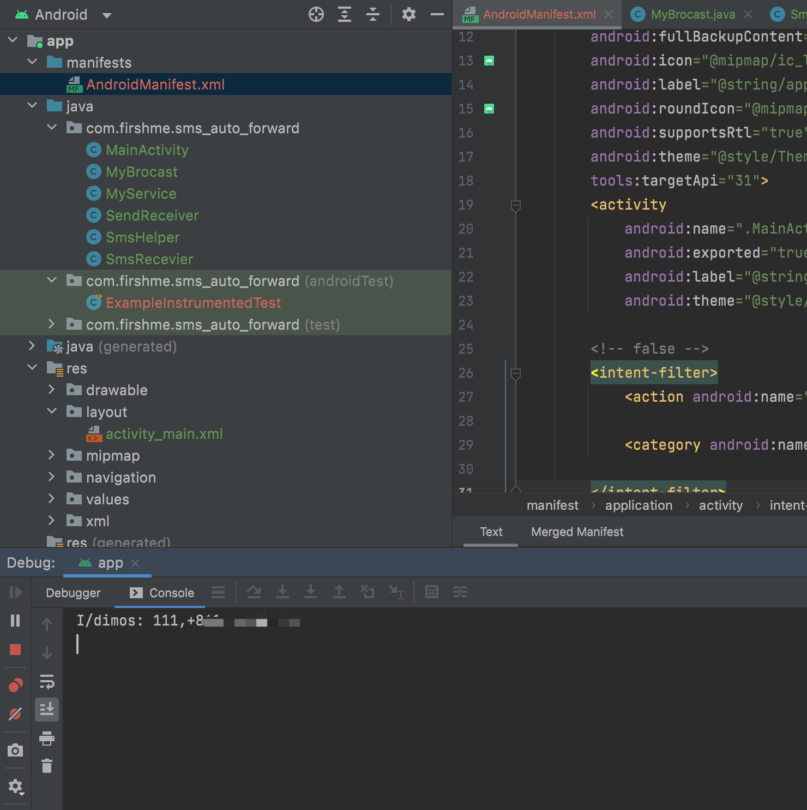
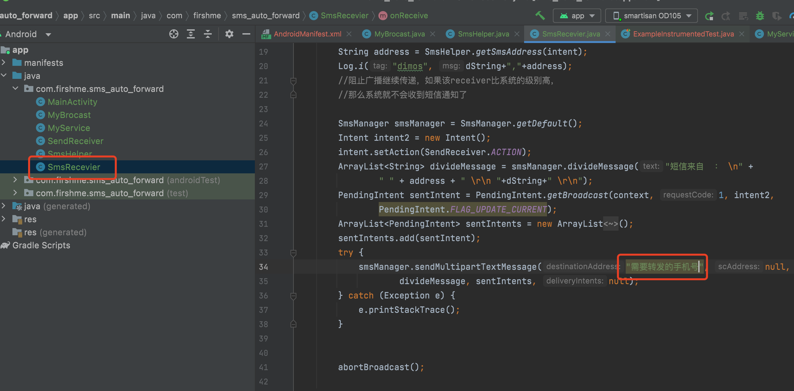

### 安卓自动转发短信APP

* 手机号转发   【支持】
* 钉钉        【未支持】
* MQTT 	      【未支持】

### 使用步骤

* 打开APP （MainActivity）
* 输入手机号点击保存
* 重新打开APP即可

### quick start

* 直接编译修改里面内置的手机号即可。

### demo

### release

* MD5 (app-debug.apk) = c117c216cbfca44384caddf6cf11f1e7
